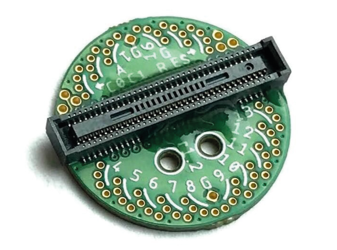

# EIB-64
64-channel electrode interface board (EIB) with electrical and optical
stimulation. Designed for small animal (e.g. mouse) tetrode electrophysiology.
Compatible with [ONIX 64-Channel Headstage](../headstage-64/) and [Shuttle
Drives](https://open-ephys.org/shuttledrive).

- 64x electrophysiology channels
- 2x optical stimulation outputs
- 1x electrical stimulator output

