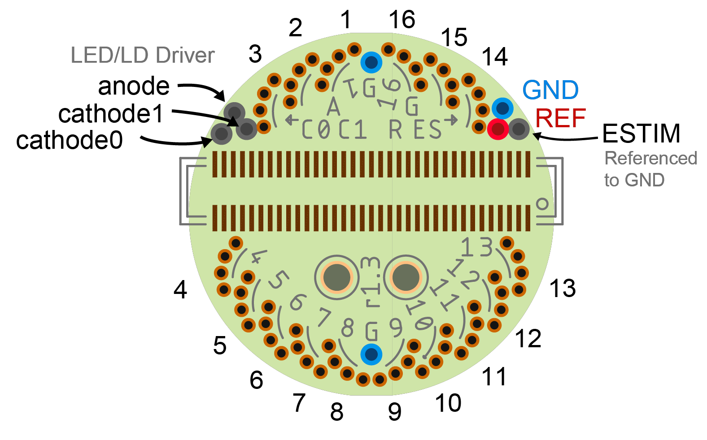

# EIB-64 PCB
Circuit design and manufacturing files for EIB-64.

## Bill of Materials
The BOM is located on [this google
sheet](https://docs.google.com/spreadsheets/d/1vJ3K68Tzy18eBl7zj2bWWYmF2zrh3wpJbKvRicM5Wa0/edit?usp=sharing)

## Pinout
The EIB pinout (ADC input mapping, stimulation connections, etc) is located on
[this google
sheet](https://docs.google.com/spreadsheets/d/11wRDYOqHN5lPb03yUdfXfK0zvaDYsVetplaNK-R90Gg/edit#gid=0)

## Tetrode Connectorization
This EIB uses Neuralynx ["small" gold
pins](https://neuralynx.com/hardware/small-eib-pins) to attach tetrode wires.
Usage instructions are provided in the [Neuralynx EIB pin
Manual](https://neuralynx.com/documents/EIB%20Pins%20Manual.pdf).

## Manufacturing Requirments
- 4 layer PCB (outer layers provide sheilding)
- 0.6-0.8 mm total thickness
- Immersion gold plating (ENIG) is required. 
- In order for the gold pins to properly fit in the designated vias, they must
  have a _plated_ inner diameter of 12±2 mil (0.3048±0.0508 mm). 

